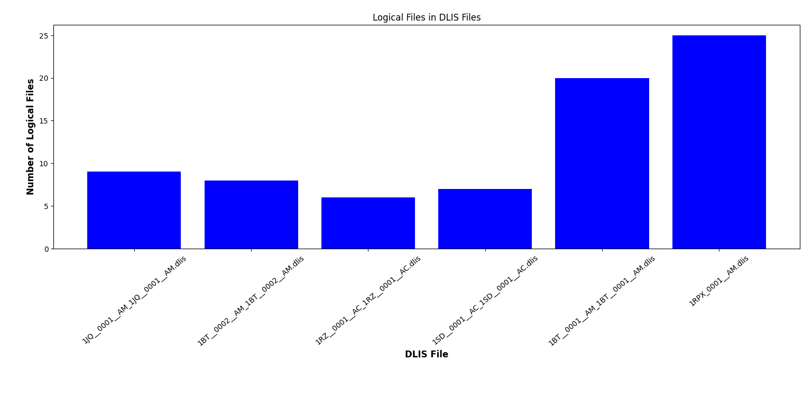

# DLIS File Processing Suite
A fast way to check the number of logical files and the number of errors in a DLIS file.



## Overview
The DLIS File Processing Suite is a Python-based tool designed for the efficient handling and analysis of Digital Log Interchange Standard (DLIS) files, commonly used in the oil and gas industry for well log data. This suite provides a set of tools for extracting metadata, processing frames, and summarizing the contents of .dlis files.

## Entities
- BeloFastFrame: Represents and processes individual frames in a DLIS file, extracting channel and index information.
- BeloDlisFast: Aggregates multiple BeloFastFrame instances, facilitating batch processing of frames from DLIS files.
- DlisFileWrapper: Wraps a DLIS file, storing metadata and error details for easy access and analysis.
- SingleBeloProcessor: Provides static methods for loading DLIS files into DlisFileWrapper objects and generating BeloDlisFast objects for comprehensive file analysis.
- General File Information Extraction: A utility function to extract general information from all .dlis files in a directory and save it as a JSON file.

## Installation
To install the DLIS File Processing Suite, clone the repository and install the required dependencies:

```bash
git clone 
cd DLIS-File-Processing-Suite
pip install -r requirements.txt
```

## Usage

The fast report rapidly processes and summarizes DLIS files, providing essential information like well names, file sizes, and error statuses in a concise, accessible format.

You can use this project in 2 ways.
Using the command line interface or using the python API.

### Command Line Interface
In the directory where the project is cloned, run the following command passing a path to a folder containg .dlis files:

```bash	
make fast_report '<path_to_file>'
```
You will be presented with a terminal looking like this:


and then a chart, like this one:


### Python API
In the project that you download this package, you can use the following API to process DLIS files.

#### Processing DLIS Files
Load a DLIS file into a wrapper:

```python	
from fastdlis.dlis_files import SingleBeloProcessor

dlis_wrapper = SingleBeloProcessor.load_dlis_wrapper('path/to/file.dlis')
```

#### Generate a report from the DLIS file:

```python	
from fastdlis.dlis_files import SingleBeloProcessor
report = SingleBeloProcessor.create_fast_report(dlis_wrapper)
```